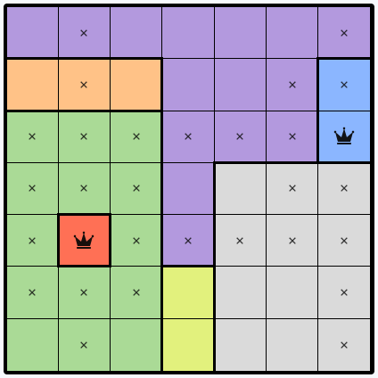

# Queens puzzle

[](https://github.com/daniel-jones-dev/queens-puzzle/actions/workflows/ci.yml)
[](LICENSE)
[](https://doc.rust-lang.org/edition-guide/rust-2024/)

A solver and generator for the **Queens** puzzle game (as made popular by LinkedIn).

This tool can solve any puzzle: using logical deduction steps the way a person would to rate its difficulty, or using
brute-force to verify validity and unique solutions. It can also generate new puzzles.

In Queens, an *n×n* board is divided into *n* coloured regions. The goal is to place *n* queens so that:

- exactly one queen sits in each **row**, each **column**, and each coloured **region**, and
- no two queens are placed **next to each other** (including diagonally).

<p align="center">
  
</p>

<p align="center"><em>A puzzle mid-solve: crowns mark placed queens and an <code>x</code> marks a cell ruled out.</em></p>

## Features

- **Logical solver** that applies human-style techniques in order of increasing difficulty and
  rates the puzzle (Trivial / Easy / Medium / Hard) by the hardest technique it needed.
- **Brute-force fallback** that finds the solution(s) for puzzles the logical solver can't crack.
- **Generator** that builds new puzzles with a guaranteed unique solution from a random seed.
- **Colourful terminal output** of boards, with optional step-by-step explanations.
- Reads puzzles from a simple **text format** or from the **archived JSON** of past LinkedIn puzzles.

> Boards are rendered with true-colour region backgrounds, so a terminal with 24-bit colour support
> gives the best results.

## Installation

Requires a [Rust toolchain](https://www.rust-lang.org/tools/install).

```sh
cargo install --git https://github.com/daniel-jones-dev/queens-puzzle
```

Or build from source:

```sh
git clone https://github.com/daniel-jones-dev/queens-puzzle
cd queens-puzzle
cargo build --release
```

The binary is then at `target/release/queens-puzzle`. The examples below use `cargo run --` for
convenience.

## Usage

```
queens-puzzle [OPTIONS] <COMMAND>

Commands:
  solve     Solve a puzzle from a file and rate its difficulty
  generate  Generate new puzzle(s), each with a unique solution

Options:
  -v, --verbose...  Increase output verbosity (-v shows solver steps, -vv also shows generator steps)
  -h, --help        Print help
  -V, --version     Print version
```

### Solve

Solve a puzzle from a text file:

```sh
cargo run -- solve puzzles/linkedin_20240926.txt
```

Solve a puzzle from the archived JSON (defaults to the lowest puzzle id; use `--id` to pick one):

```sh
cargo run -- solve --json puzzles/linkedinPuzzles.json --id 353
```

Show each deduction step-by-step:

```sh
cargo run -- -v solve puzzles/linkedin_20240926.txt
```

### Generate

Generate a single 8×8 puzzle:

```sh
cargo run -- generate
```

Generate three 10×10 puzzles from a fixed seed (puzzle *i* uses `seed + i`):

```sh
cargo run -- generate --size 10 --count 3 --seed 42
```

Each generated puzzle is printed along with the difficulty rating it would receive. Add `-vv` to
watch the generator grow and shrink regions as it searches.

## Puzzle file formats

See [docs/formats.md](docs/formats.md) for the full specification of all supported formats (text,
archived JSON, and canonical JSON).

## How it works

### Solver

The solver repeatedly scans the board for the easiest applicable technique, applies it, and starts
over until the puzzle is solved or no technique applies. Each technique reports a human-readable
explanation (shown with `-v`). The difficulty is the hardest technique that was required:

| Difficulty | Technique | Idea |
|------------|-----------|------|
| Trivial | Mark queen | If a row, column, or region has only one cell left, it must be a queen. |
| Trivial | Mark empty | Every cell connected to a queen (same row, column, region, or diagonally adjacent) must be empty. |
| Easy | Pointers | If a region's remaining cells all lie in one row/column, the rest of that row/column must be empty. |
| Medium / Hard | Naked set | *N* cells in a block that between them must hold a queen force other cells empty. |
| Hard | Hidden set | *N* regions confined to *N* rows/columns must hold those queens, emptying the rest of those rows/columns. |

If logic gets stuck, the **brute-force** solver places one queen per column recursively (respecting
any queens already deduced) and reports the solution(s) it finds.

### Generator

The generator first places *n* non-attacking queens at random, then gives each queen its own
single-cell region. It repeatedly grows regions into neighbouring cells, backtracking whenever a
move would make the solution non-unique, until every cell is assigned. The result is guaranteed to
have exactly one solution.

## Puzzle archive

[playqueensgame.com](https://www.playqueensgame.com) has an archive of every puzzle that has
appeared on LinkedIn. Individual puzzles can be fetched from
`https://www.playqueensgame.com/api/daily?date=YYYY-MM-DD`.
(`https://queensstorage.blob.core.windows.net/puzzles/linkedinPuzzles.json` is another, incomplete,
source.)

## Next steps

Ideas for future work, roughly in priority order:

- **Web UI** — a React frontend backed by the Rust solver/generator compiled to WASM via
  `wasm-bindgen`. The UI should support playing puzzles interactively, editing or drawing custom
  boards, stepping through the solver's deductions one move at a time, and generating new puzzles
  on demand.
- **More solving techniques**, to reduce reliance on brute force:
  - a rule for when a region's remaining unknowns all lie in a single row or column;
  - a rule for two or three candidate cells adjacent to each other crossing out their shared neighbours;
  - splitting the naked-set rule into more specific, easier-to-spot cases.
- **Record the list of changes** the solver makes, to support a move history / undo and richer hints.
- **Faster generation**: when growing a region, immediately absorb any unregioned "islands" it
  encloses (those cells can only belong to that region).
- **Performance**: memoise `queens()` rather than rescanning the board.
- **Refactor** the core puzzle representation (grid, cell state, IO, change list) into its own module/crate.
- **Fetch command** to download puzzles directly from the archive API.

## License

Released under the [MIT License](LICENSE).
